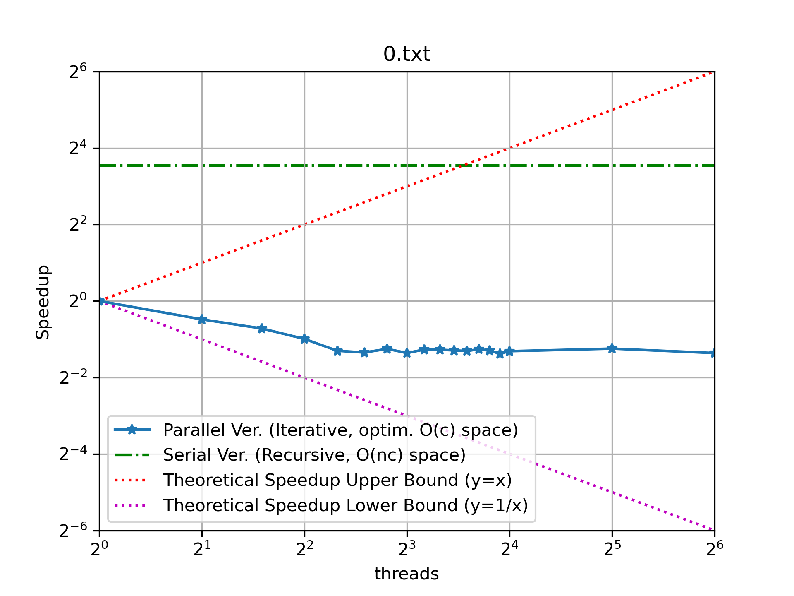
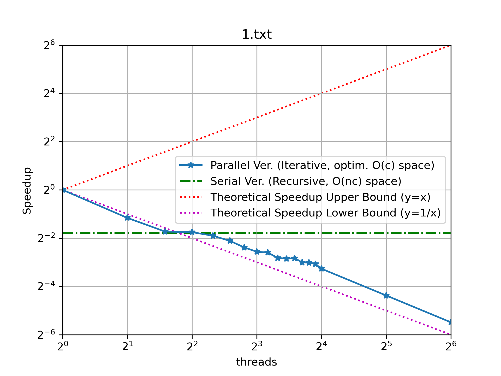
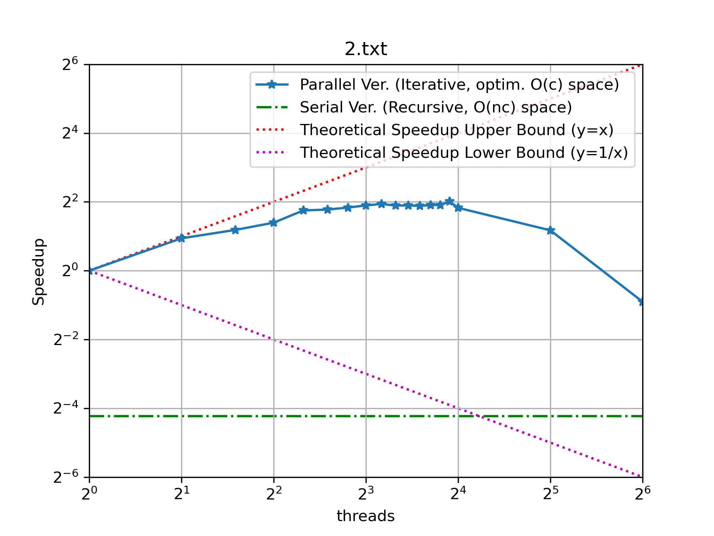
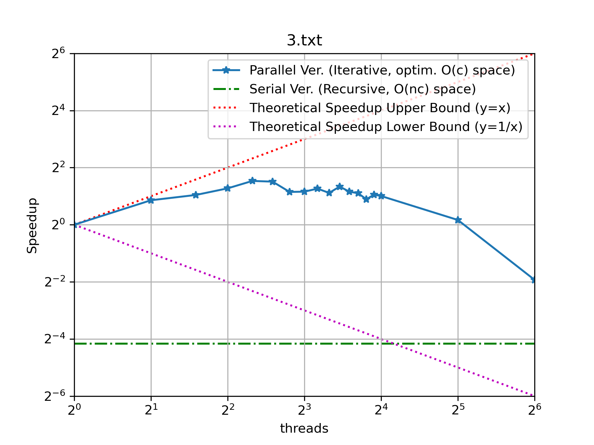
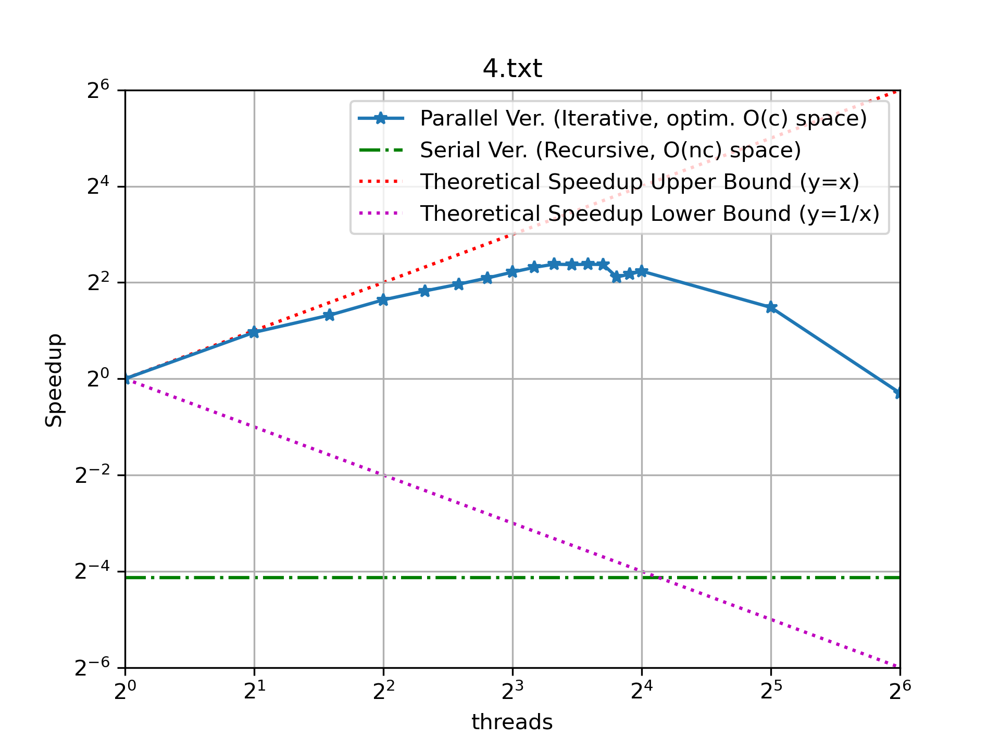
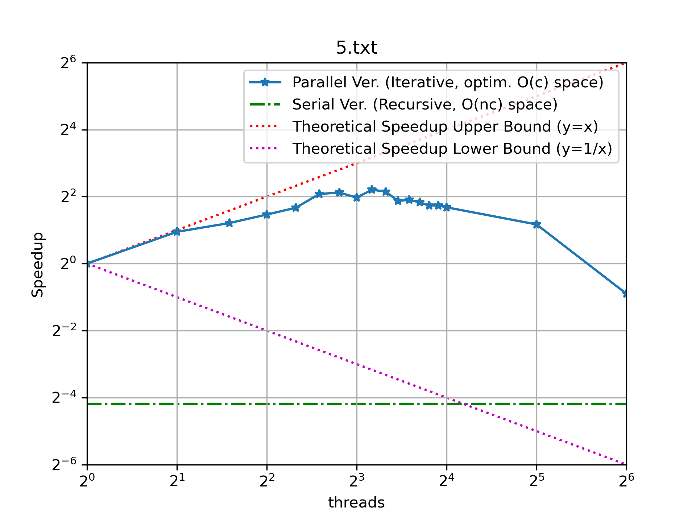

# Distributed KnapSack Problem

Submission includes:

- [x] Your parallel version of knapsack, see [source](./src/knapsack.cpp)
- [x] A readme explaining your code (this file) <a href="#explanation">here</a>
- [x] A text file called [averages.txt](./average.txt) that gives the average execution time of your parallel version on 1, 2, 4, 8, and 16 threads as well as the provided serial version on each input.
- [x] (458) Your values of the number of threads needed to achieve the maximum speedup for each input, as well as the graphs of the speedup vs the number of threads on each input. <a href="#speedup">here</a>

## Structure and Compilation

The zip file should be structured as follows:

```ini
.
|-- build/          # Compiled binaries after make
|   |-- apps/
|   |   `-- src/
|   |       `-- knapsack
|   `-- objects/
|-- inputs/         # inputs for the knapsack problem
|-- log/            # logs recording performance
|-- res/            # results of the knapsack problem
|   `-- *.png
`-- src/            # dir for source code
    `-- knapsack.cpp
```

to compile the code, run the following commands:

```bash
$ make          # default compilation
$ make release  # compile with -O2 optimization
$ ln -s build/apps/src/
```

Binaries will be located in `./build/apps/src/` directory. You may soft link it to `./bin/` directory for easier access.

```bash
# run eithor for the SERIAL version
$ ./build/apps/src/knapsack < inputs/1.txt
$ ./build/apps/src/knapsack 0 < inputs/1.txt
# run eithor for the PARALLEL version
$ ./build/apps/src/knapsack 1 < inputs/1.txt
```

The program takes one command line argument as `num_threads`. 
- If `num_threads=0` or not provided, run the serial version. 
- `num_threads>=1`, run the parallel version with `num_threads` threads.

<a id="explanation"></a>

## Code Explanation

Our DP algorithm constructs a DP table $n\cdot c$, where $n$ denotes number of items and $c$ denotes max capacity.

$$
\forall j \in [0,c],\text{DP}[i][j] = \text{solve}(\text{DP}[i-1], j)\\
=\begin{cases}
\text{DP}[i-1][j] & \text{, if } j<w_i;\\
\max(\text{DP}[i-1][j], \text{DP}[i-1][j-w_i] + v_i)& \text{, otherwise}.\\
\end{cases}
$$

```ini
        0 1 2 w ... c
i_0    |z| | |z|...| |
i_1    | | | |x|...| |      # obviously x dep on the two z's
...    | | | | |...| |
i_N-1  | | | | |...| |
```

Therefore `cur_row` dependents on the `prev_row` only. Individual columns within `cur_row` are independent. There are only reads on the `prev_row` and writes on `cur_row`, We can parallelize this algorithm by distribute the tasks column-wise to threads. For each threat `t`:

$$
j \in[l_t, r_t), 
\text{DP}[i][j]=\text{solve}(\text{DP}[i-1], j)
$$

We only increament `i` after the current row have been filled. A pseudocode is as follows:

```swift
func knapsack_parallel(int n, int capacity, int num_threads):
	barrier sync_point(num_threads)

	// solves range [l, r) for all n items, 
	// after each row is done, hit barrier to sync between threads
	func knapsack_worker(int l, int r):
		// initialize the first row
        // and wait for current row to finish
		init(first_row)
		sync_point.arrive_and_wait()

		// iterate through second-to-last rows
        // and wait for current row to finish
        for cur_row in [1, n-1]:
            for col in [l, r-1]:
                cur_row[col] <- update(based_on: prev_row, col)
			sync_point.arrive_and_wait()

	// distribute tasks and wait for all threads to finish
	distribute_tasks(threads[], knapsack_worker, l[], r[])
    join_threads()

	return opt[n-1][capacity]
```

<a id="speedup"></a>

## Speedup VS Threads

input|speedup curve|best n threads
|:-:|:-:|:-:
`0.txt`||1
`1.txt`||1
`2.txt`||10
`3.txt`||10
`4.txt`||12
`5.txt`||12