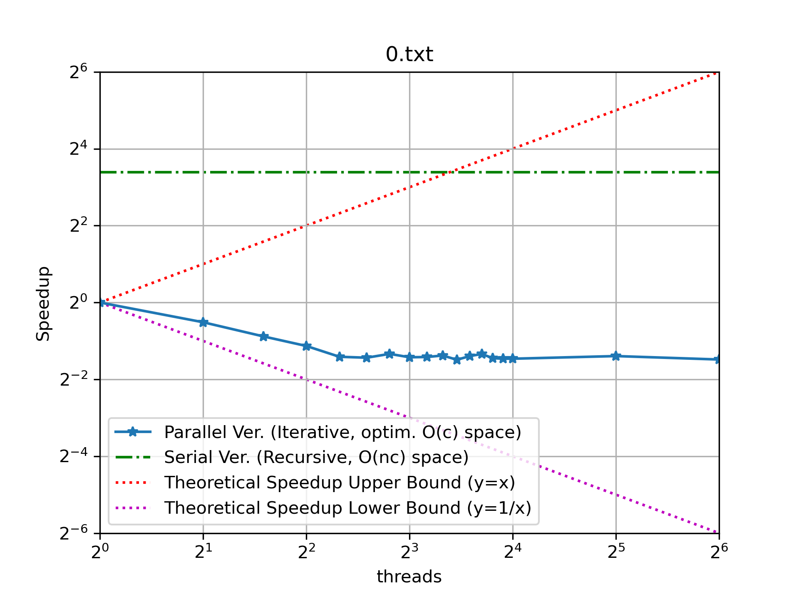
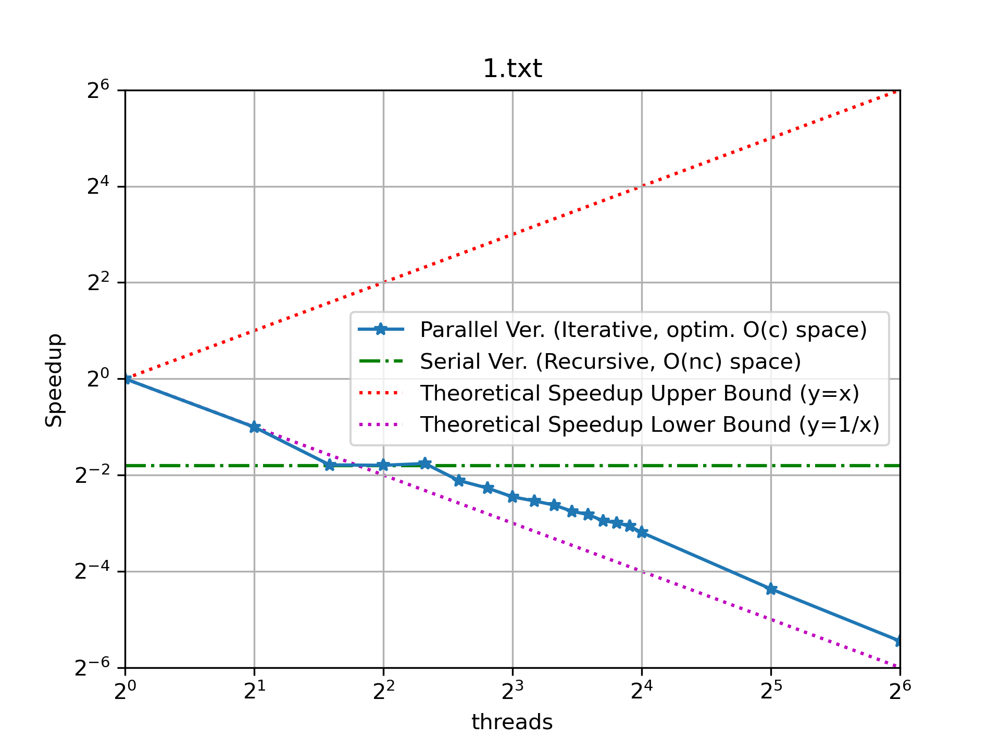
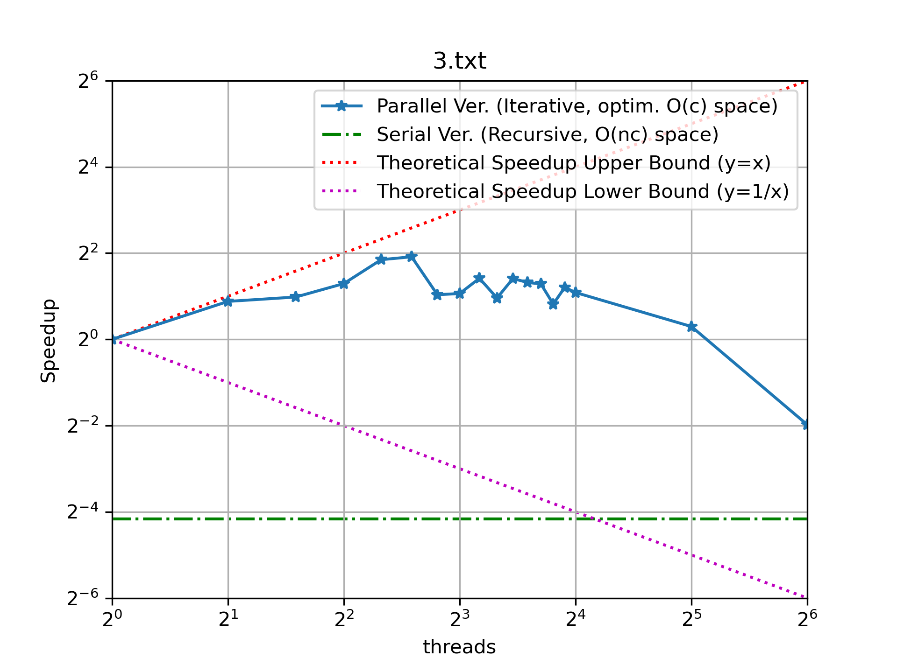

# Distributed KnapSack Problem

 > @author Meng Wang  
 > @email mwang106@ur.rochester.edu  
 > @create date 2024-02-22 15:25
 > @modify date 2024-02-23 22:09
 > @desc Assignment 1: Distributed Knapsack Problem, Parallel and Distributed Systems CSC458 SPRING 2024

Submission includes:

- [x] Your parallel version of knapsack, see [./src/knapsack.cpp](./src/knapsack.cpp)
- [x] A readme explaining your code. <a href="#explanation">navigate.</a>
- [x] A text file called [averages.txt](./average.txt) (*results obtained on cycle2, serial are marked threads=0*) that gives the average execution time of your parallel version on 1, 2, 4, 8, and 16 threads as well as the provided serial version on each input.
- [x] (458) Your values of the number of threads needed to achieve the maximum speedup for each input, as well as the graphs of the speedup vs the number of threads on each input. <a href="#speedup">navigate.</a>

## Structure and Compilation

The zip file should be structured as follows:

```ini
.
|-- inputs/         # inputs for the knapsack problem
|-- res/            # results of the knapsack problem
|   `-- *.png
`-- src/            # dir for source code
    `-- knapsack.cpp
```

to compile the code, run the following commands:

```bash
$ make          # default compilation
$ make release  # compile with -O2 optimization
```

Binaries will be located in `./build/apps/src/` directory. You may soft link it to `./bin/` directory for easier access. The program takes the first cmdline argument as `num_threads`. 

- If `num_threads=0` or not provided, run the serial version. 
- `num_threads>=1`, run the parallel version with `num_threads` threads.

```bash
# run SERIAL version, two are equivalent.
$ ./build/apps/src/knapsack < inputs/1.txt
$ ./build/apps/src/knapsack 0 < inputs/1.txt
# run PARALLEL version, with n_threads as arg
$ ./build/apps/src/knapsack 1 < inputs/1.txt
$ ./build/apps/src/knapsack 2 < inputs/1.txt
```

<a id="explanation"></a>

## Code Explanation

The basic DP algorithm constructs a DP table $n\cdot (c+1)$, where $n$ denotes number of items and $c$ denotes max capacity. 

$$
\forall j \in [0,c],
\text{DP}[i][j] = \text{worker}(\text{DP}[i-1], j)
$$
where
$$
\text{worker}(arr, j)=\begin{cases}
arr[j] & \text{if } j\lt w_i\\
\max(arr[j], arr[j-w_i] + v_i)& \text{otherwise}\\
\end{cases}
$$

```ini
        0 1 . w . c
i_0    |a| | |a|.| |
i_1    | | | |b|.| |    # obviously b only dep on the two a's
...    | | | | |.| |
i_N-1  | | | | |.| |	# the same applys to all (prev, cur) row pairs
```

Therefore `cur_row` dependents on the `prev_row` only, where there are:
- only reads on the `prev_row`
- only writes on `cur_row`
- depedency `cur_row` -> `prev_row`, `next_row` -> `cur_row`

We can swap `cur_row` and `prev_row` to simulate rolling two consecutive rows in the DP table in a **iterative** manner. This can optimize space to $O(c)$, i.e. two rows' space. We can only go to next row after the current row has been filled. 

We can parallelize this algorithm by distributing non-overlapping tasks column-wise to threads. For all thread `t`, it only receives a set of tasks $S_t$ from $S=\{0, 1, \dots, c\}$ such that

$$
\cup_{t} S_t = S, \\
S_t \cap S_{t'}=\emptyset, t\neq t' \\
$$

Pseudo-code is as follows:

```swift
func knapsack_parallel(n: int, capacity: int, num_threads: int):
	barrier sync_point(num_threads)

	// solves range [l, r) for all n items, 
	// after each row is done, hit barrier to sync between threads
	func knapsack_worker(int l, int r):
		// initialize the first row and sync
		init(first_row)
		sync_point.arrive_and_wait()

		// iterate through each row in second-to-last rows
        // and wait for current row to finish
        for cur_row in [1, n-1]:
            for col in [l, r-1]:
                cur_row[col] <- update(based_on: prev_row, col)
			sync_point.arrive_and_wait()

	// distribute tasks and wait for all threads to finish
	parition_tasks(threads[], knapsack_worker)
    join_threads()

	return opt[n-1][capacity]
```

<a id="speedup"></a>

## Speedup VS Threads

input|best `n_threads`|speedup curve
|:-:|:-:|:-:
`0.txt`|1|
`1.txt`|1|
`2.txt`|15|
`3.txt`|5|
`4.txt`|10|
`5.txt`|9|
